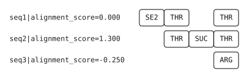

# NATU: NRPS Alignment of Thiotemplated Units

## Installation

Create a conda environment and install the dependencies:

```bash
conda create -n natu python=3.10
conda activate natu
pip install .
```

## Usage

Create MSA:

```bash
natu align -s match_mismatch -f data/test.fa -o data/test.msa
```

Draw MSA as SVG:
```bash
natu draw -m data/test.msa -o data/test.msa.svg   
```

